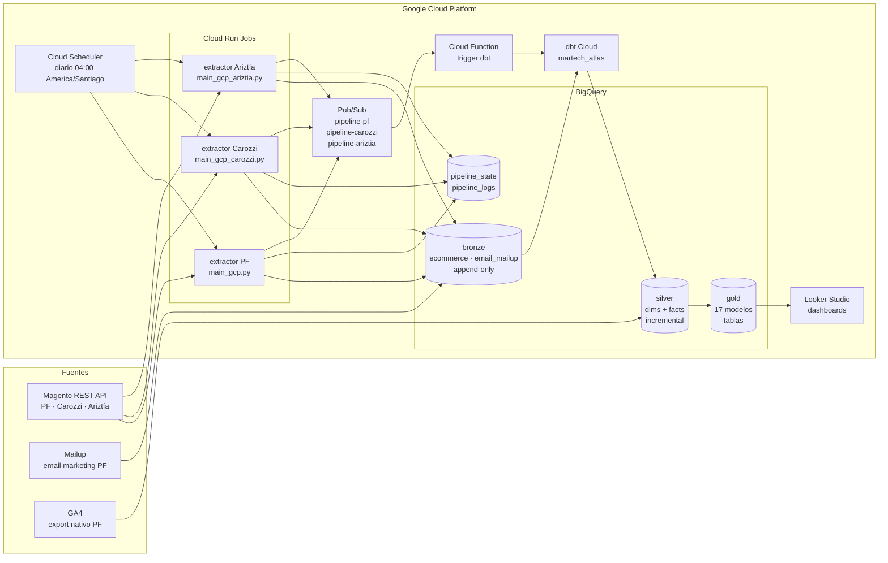

# Arquitectura — Plataforma de datos MarTech (ATLAS)

## 1. Visión general

La plataforma migra los ETL artesanales (scripts Python → MySQL local) a un pipeline diario en **Google Cloud Platform** con arquitectura **medallion** (Bronze → Silver → Gold) sobre BigQuery, transformaciones con dbt Cloud y consumo en Looker Studio.

Proyecto GCP: `martech-data-platform-atlas`.

## 2. Diagrama del pipeline diario

## 3. Capas y responsabilidades

| Capa | Contenido | Tecnología | Materialización |
|---|---|---|---|
| **Bronze** | Datos crudos tal como llegan (`raw_json`), sin transformar. Tablas `ecommerce` y `email_mailup`. | BigQuery, `WRITE_APPEND` | Append-only |
| **Staging** | 16 vistas que parsean el JSON crudo y normalizan por tenant (`stg_pf__*`, `stg_mc__*`, `stg_aatn__*`). | dbt | `view` |
| **Silver** | 9 dimensiones y hechos incrementales con `MERGE` y `unique_key` compuestas con `tenant_id` (ej. `dim_client`, `fact_orders`). | dbt | `incremental` |
| **Gold** | 17 tablas de negocio: KPIs diarios, RFM (`customer_360`), performance de campañas, sesiones web, etc. | dbt | `table` |

### Tablas operacionales (Bronze)

- `pipeline_state`: watermarks por tenant/entidad (última sincronización) para extracción delta.
- `pipeline_logs`: bitácora de cada ejecución (estado, conteos, errores).

## 4. Servicios GCP y su rol

| Servicio | Rol |
|---|---|
| Cloud Scheduler | Dispara la ejecución diaria a las 04:00 (hora de Chile) |
| Cloud Run (Jobs) | Ejecuta los 3 extractores contenerizados (uno por tenant) |
| BigQuery | Data warehouse: datasets `bronze`, `silver`, `gold` |
| Pub/Sub | Desacopla extracción de transformación; un tópico por tenant |
| Cloud Function | Recibe el mensaje de Pub/Sub y dispara la corrida de dbt Cloud |
| dbt Cloud | Transformaciones medallion (proyecto `martech_atlas`) |
| Looker Studio | Dashboards sobre la capa Gold |
| Secret Manager | (Objetivo) almacenamiento de tokens y credenciales |

> Nota: el repositorio versiona los extractores (`pipelines/`), los modelos dbt (`models/`), macros y seeds. La definición del Scheduler y la Cloud Function son configuración de infraestructura en la consola de GCP, no código del repo.

## 5. Decisiones de diseño

1. **Medallion**: cada capa aumenta la calidad del dato; ante un fallo siempre se puede reconstruir desde Bronze, donde el dato original está intacto.
2. **`tenant_id` en todas las llaves**: aislamiento lógico multi-tenant (PF, Carozzi, Ariztía) en datasets compartidos.
3. **Incremental con MERGE**: las tablas silver solo procesan lo nuevo (`ingested_at > MAX(ingested_at)`), reduciendo costo y tiempo.
4. **Watermarks en `pipeline_state`**: la extracción es delta por entidad (nuevos + actualizados), no full load diario.
5. **Pub/Sub como gatillo**: la transformación solo corre cuando la extracción termina, sin acoplar ambos procesos.
6. **Contenerización por tenant**: cada extractor es una imagen Docker independiente; se versiona, se prueba y se despliega por separado.
