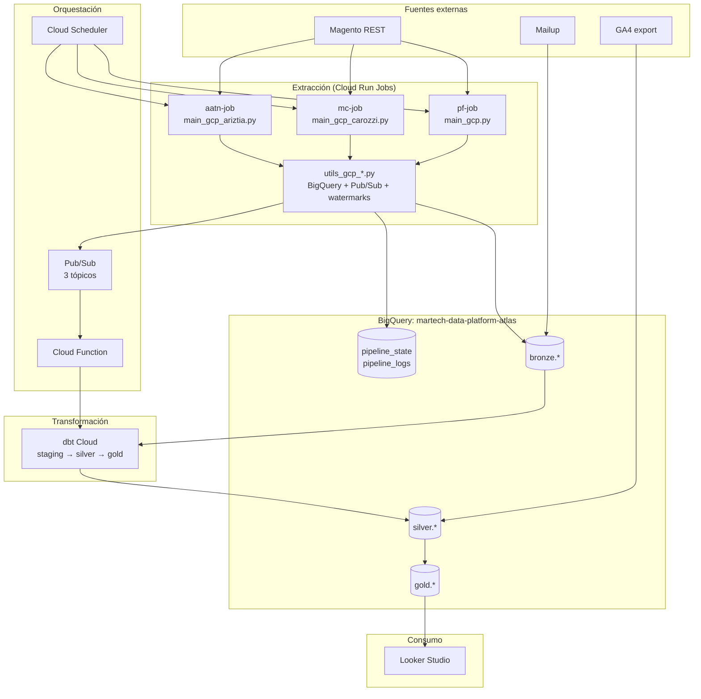
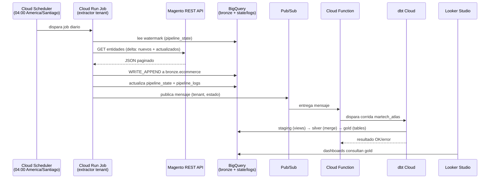

# Diagramas UML — Proyecto MarTech (ATLAS)

## 1. Diagrama de componentes



## 2. Diagrama de secuencia — ejecución diaria



## 3. Diagrama de secuencia — manejo de error en extracción

```mermaid
sequenceDiagram
    participant R as Extractor
    participant M as Magento API
    participant B as BigQuery (pipeline_logs)

    R->>M: GET página N
    M-->>R: 429 / timeout
    R->>R: retry con backoff + throttling
    M-->>R: 200 OK
    R->>B: append parcial a bronze
    R->>B: log estado=error (entidad, página)
    Note over R,B: el watermark NO avanza en entidades fallidas;<br/>la próxima corrida reintenta el delta pendiente
```
