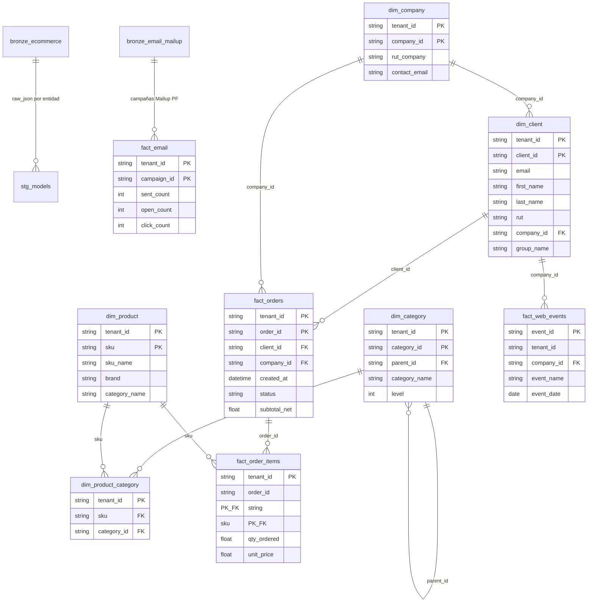

# Modelo de datos — Plataforma MarTech (ATLAS)

## 1. Organización por capas (dbt, proyecto `martech_atlas`)

| Capa | Modelos | Materialización | Propósito |
|---|---|---|---|
| **Staging** | 16 vistas `stg_{pf,mc,aatn}__*` | `view` (schema `staging`) | Parsear `raw_json` de Bronze y normalizar columnas por tenant |
| **Silver** | 5 dimensiones + 4 hechos | `incremental` (merge) | Entidades limpias, deduplicadas, con llaves compuestas `tenant_id + id natural` |
| **Gold** | 17 tablas | `table` (schema `gold`) | Métricas y agregados listos para el negocio |

Fuentes declaradas en `models/silver/sources.yml`: `bronze.ecommerce`, `bronze.email_mailup`, `ga4_pf.events_*` (proyecto `martech-data-platform-atlas`) y seed `comunas_regiones`.

## 2. Diagrama entidad-relación (capa Silver)

> Todas las relaciones se resuelven siempre compuestas con `tenant_id` (aislamiento multi-tenant).

## 3. Descripción por capa

### Staging (16 vistas)

Normalizan el JSON crudo de Bronze a columnas tipadas por tenant y entidad: clientes, órdenes, items, productos, compañías y accesos (`stg_pf__clients`, `stg_mc__orders`, `stg_aatn__products`, etc.). No contienen lógica de negocio; solo parseo, casteo y renombre.

### Silver (9 modelos incrementales)

- **Dimensiones**: `dim_client` (PF/MC/Ariztía, con overlay de prospectos y resolución de empresa por RUT), `dim_company` (solo PF, con contacto comercial resuelto), `dim_product`, `dim_category` (niveles 2–3 del árbol Magento), `dim_product_category` (puente N:N).
- **Hechos**: `fact_orders` (con manejo de overlay de status para Ariztía y conversión de zona horaria Chile), `fact_order_items`, `fact_email` (Mailup, deduplicado por campaña, con columnas protegidas de edición manual), `fact_web_events` (GA4, identidad B2B por `company_id`).
- Estrategia incremental: `MERGE` sobre `unique_key` compuesta; partición por mes y cluster por `tenant_id`.

### Gold (17 tablas)

Agregados de negocio: `customer_360` (RFM por quintiles), `kpi_orders_daily`, `kpi_customers`, `product_performance`, `category_performance`, `category_per_order`, `category_combinations`, `order_depth`, `email_performance`, `email_ga4_performance`, `campaign_performance`, `campaign_email_detail`, `client_type_daily`, `group_details`, `segments`, `monthly_summary`, `web_sessions_daily`.

## 4. Seeds y utilidades

- `seed/comunas_regiones.csv`: catálogo región → comunas de Chile para normalización geográfica.
- Macros: `normalize_string` (quita tildes y normaliza texto), `ga4_param` (extrae parámetros de eventos GA4), `generate_schema_name` (nombres de esquema por entorno).
